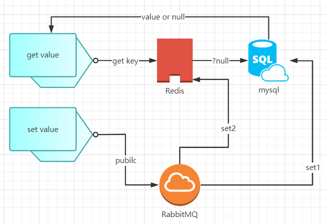
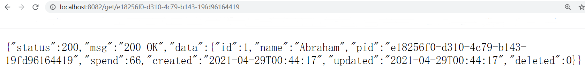
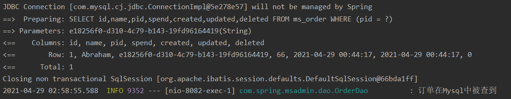
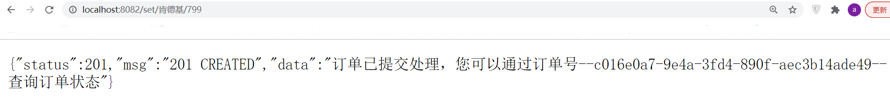
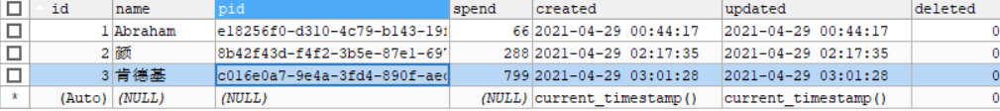
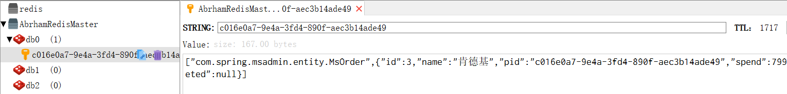
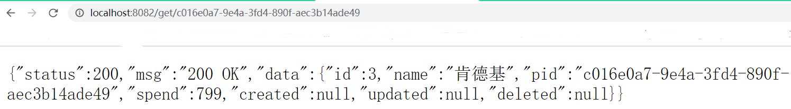
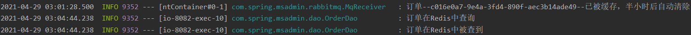

# 基于RabbitMQ和Redis做的流量削峰简单版

我们都明白某一瞬间突发的高峰访问量全打Mysql上将是容易冲垮数据库的

本项目的设计想法是在Mysql的上层以添加中间件的方式给数据库加以保护

在数据读的时候先查Redis，查不到才会查数据库

在数据写时会先请求RabbitMQ发送消息，再在队列里完成mysql业务及Redis的缓存

设计蓝图如下



## 核心代码块

- 订单数据的查模块

``` java
public RestResponse<MsOrder> get(String pid) {
   MsOrder order = (MsOrder) redisUtil.get(pid);
    if(order != null) {
      log.info("订单在Redis中被查到");
      return new RestResponse<MsOrder>(HttpStatus.OK.value(), HttpStatus.OK.toString(),order);
    }
    order = iMsOrderService.getOrderByPid(pid);
    if (order != null){
      log.info("订单在Mysql中被查到");
      return new RestResponse<MsOrder>(HttpStatus.OK.value(), HttpStatus.OK.toString(),order);
    } return new RestResponse<MsOrder>(HttpStatus.NOT_FOUND.value(), HttpStatus.NOT_FOUND.toString(),null);
}
```

- 创建订单数据模块

``` java
public RestResponse<String> add(String user, Integer spend){
  String idCode = user + new Date().getTime();
  String pid = UUID.nameUUIDFromBytes(idCode.getBytes()).toString();
  MsOrder order = new MsOrder(user,pid,spend);
  return new RestResponse<String>(HttpStatus.CREATED.value(),HttpStatus.CREATED.toString(),mqService.makeOrder(order));
}
```

``` java
@RabbitHandler
@RabbitListener(queues = "ms_order")
public void MsOrderMessage(MsOrder order) {
  boolean created = iMsOrderService.save(order);
    if(created) {
      redisUtil.set(order.getPid(), order, 1800);
      log.info("订单--"+order.getPid()+"--已被缓存，半小时后自动清除");
    } else {
      log.info("订单提交失败");
      throw new OrderException("订单提交失败");
    }
}
```

## 演示结果

- 很早就被创建的订单只能在数据库查到到





- 从现在开始被创建的订单既会持久化也会缓存







- 并且该订单如果查也只能在缓存中被查到




